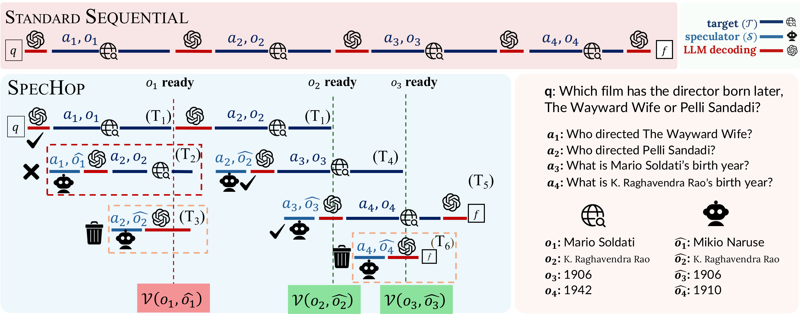

# SpecHop: Continuous Speculation for Accelerating Multi-Hop Retrieval Agents

Official repository for **SpecHop**.

> Paper title: *SpecHop: Continuous Speculation for Accelerating Multi-Hop Retrieval Agents*  
> Authors: *Mehrdad Saberi, *Keivan Rezaei, Soheil Feizi  
> arXiv: https://arxiv.org/abs/2605.21965

## Overview



SpecHop is a continuous speculation framework for accelerating multi-hop tool-use trajectories in retrieval-augmented agents. It uses a fast speculator to propose intermediate tool observations while the target tool runs in parallel, verifies speculative observations asynchronously, commits verified branches, and rolls back downstream speculative branches when verification fails. This design reduces wall-clock latency while preserving the verified trajectory and final answer quality.

**Code will be released soon...**

## Citation

If you find this work useful, please cite:

```bibtex
@article{saberi2026spechop,
  title={SpecHop: Continuous Speculation for Accelerating Multi-Hop Retrieval Agents},
  author={Saberi, Mehrdad and Rezaei, Keivan and Feizi, Soheil},
  journal={arXiv preprint arXiv:2605.21965},
  year={2026}
}
```

## Contact

For questions, please open an issue in this repository.
